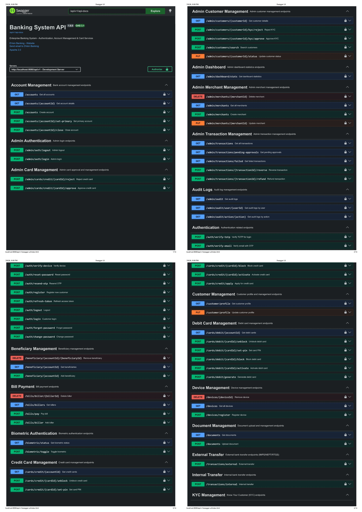

# DVein Banking Backend

### Enterprise-Grade Banking System REST API

*A comprehensive, production-ready banking backend built with Spring Boot*

[](https://openjdk.org/projects/jdk/21/)
[](https://spring.io/projects/spring-boot)
[](https://spring.io/projects/spring-security)
[](https://www.postgresql.org/)
[](https://jwt.io/)
[](https://flywaydb.org/)
[](https://swagger.io/)
[](https://projectlombok.org/)
[](https://maven.apache.org/)

[](https://www.apache.org/licenses/LICENSE-2.0.html)
[]()
[](http://localhost:8080/swagger-ui/index.html)

---

## About

**DVein Banking Backend** is a full-featured, enterprise-grade banking REST API built with **Spring Boot 3** and **Java 21**. It provides a robust, secure, and scalable backend infrastructure for modern digital banking applications — covering everything from user authentication and KYC to UPI payments, card management, transaction processing, and admin operations.

The system is designed with **security-first** architecture, featuring multi-factor authentication (TOTP + device verification), JWT-based session management, fraud detection, and comprehensive audit logging — making it production-ready for real-world banking scenarios.

---

## Screenshots

<div align="center">

### API Documentation Interface

</div>

---

## Key Highlights

- **Multi-Layer Security** — JWT Auth + TOTP (Google Authenticator) + Device Verification + MPIN
- **Complete Payment Ecosystem** — UPI, IMPS, NEFT, RTGS, Bill Payments, Merchant Payments
- **Card Management** — Debit & Credit card lifecycle management with PIN security
- **Smart Automation** — Scheduled payments, standing instructions, daily limit resets
- **Fraud Detection** — Real-time transaction monitoring and flagging
- **Admin Dashboard** — Full admin control panel with audit logs and analytics
- **Auto Documentation** — Interactive Swagger UI with complete API documentation
- **Schema Migrations** — Versioned database migrations via Flyway

---

## Tech Stack

| Layer | Technology |
|-------|-----------|
| **Language** | Java 21 |
| **Framework** | Spring Boot 3.5.15 |
| **Security** | Spring Security 6, JWT (JJWT 0.11.5) |
| **Database** | PostgreSQL |
| **ORM** | Spring Data JPA / Hibernate |
| **Migrations** | Flyway 12.8.1 |
| **2FA** | TOTP via `dev.samstevens.totp` |
| **QR Code** | ZXing (Google) 3.5.4 |
| **Email** | Spring Boot Mail |
| **Password Hashing** | jBCrypt 0.4 |
| **API Docs** | SpringDoc OpenAPI 3.1 (Swagger UI) |
| **Code Generation** | Lombok |
| **Build Tool** | Apache Maven |

---

## Project Structure

```
src/main/java/com/dvein/banking_backend/
│
├── account/ → Accounts, KYC, Documents, Nominees, Beneficiaries
├── admin/ → Admin Auth, Dashboard, Customer Mgmt, Audit Logs
├── auth/ → Authentication, Sessions, Devices, TOTP, MPIN
├── card/ → Debit & Credit Card Management
├── transaction/ → Transfers, UPI, Bills, Merchants, Limits, Receipts
├── notification/ → Email Service & Templates
└── common/ → Config, Security, Enums, Utils, Exceptions
```

---

## Getting Started

### Prerequisites

Make sure you have the following installed:

- **Java 21** — [Download](https://openjdk.org/projects/jdk/21/)
- **PostgreSQL** (v14+) — [Download](https://www.postgresql.org/download/)
- **Maven 3.x** — [Download](https://maven.apache.org/download.cgi)
- **Git** — [Download](https://git-scm.com/)

---

### Clone the Repository

```bash
git clone https://github.com/CoreCoderX/BankBackendApp.git
cd BankBackendApp
```

---

### Configuration

#### 1. Create the PostgreSQL Database

```sql
CREATE DATABASE banking_db;
CREATE USER banking_user WITH PASSWORD 'your_password';
GRANT ALL PRIVILEGES ON DATABASE banking_db TO banking_user;
```

#### 2. Configure application-dev.properties

```properties
# Database
spring.datasource.url=jdbc:postgresql://localhost:5432/banking_db
spring.datasource.username=banking_user
spring.datasource.password=your_password

# JWT
jwt.secret=your-256-bit-secret-key-here
jwt.expiration=86400000
jwt.refresh-expiration=604800000

# Mail (for OTP)
spring.mail.host=smtp.gmail.com
spring.mail.port=587
spring.mail.username=your-email@gmail.com
spring.mail.password=your-app-password
spring.mail.properties.mail.smtp.auth=true
spring.mail.properties.mail.smtp.starttls.enable=true
```

#### 3. Set Active Profile

In `application.properties`:

```properties
spring.profiles.active=dev
```

---

### Run the Application

**Using Maven:**

```bash
.\mvnw spring-boot:run
```

**Build & Run JAR:**

```bash
.\mvnw clean package -DskipTests
java -jar target/banking-backend-0.0.1-SNAPSHOT.jar
```

The application starts at: `http://localhost:8080`

**Note:** Flyway automatically runs all database migrations on startup — no manual schema setup needed.

---

## API Documentation

Once running, access the interactive Swagger UI:

```
http://localhost:8080/swagger-ui/index.html
```

OpenAPI JSON spec:

```
http://localhost:8080/v3/api-docs
```

---

## Authentication Flow

```
1. POST /api/v1/auth/register        → Register & receive email OTP
2. POST /api/v1/auth/verify-email    → Verify email with OTP
3. POST /api/v1/auth/login           → Login (returns JWT or pre-auth token)
4. POST /api/v1/auth/verify-device   → [If new device] Verify via email OTP
5. POST /api/v1/auth/verify-totp     → [If 2FA enabled] Verify TOTP code
6. Use Bearer <accessToken>          → Authenticate all subsequent requests
7. POST /api/v1/auth/refresh-token   → Refresh expired access token
8. POST /api/v1/auth/logout          → Invalidate session
```

**All protected endpoints require:** `Authorization: Bearer <your_jwt_token>`

---

## API Modules Overview

### Authentication & Security

| Method | Endpoint | Description |
|--------|----------|-------------|
| POST | /auth/register | Register new customer |
| POST | /auth/login | Customer login |
| POST | /auth/verify-email | Verify email OTP |
| POST | /auth/verify-device | Verify new device |
| POST | /auth/verify-totp | Verify TOTP for login |
| POST | /auth/forgot-password | Request password reset |
| POST | /auth/reset-password | Reset with OTP |
| POST | /auth/change-password | Change password |
| POST | /auth/refresh-token | Refresh access token |
| POST | /auth/logout | Logout session |

### Account Management

| Method | Endpoint | Description |
|--------|----------|-------------|
| GET | /accounts | Get all accounts |
| POST | /accounts | Create new account |
| GET | /accounts/{accountId} | Get account details |
| POST | /accounts/{accountId}/set-primary | Set primary account |
| POST | /accounts/{accountId}/close | Close account |

### Transactions & Transfers

| Method | Endpoint | Description |
|--------|----------|-------------|
| POST | /transactions/internal | Internal bank transfer |
| POST | /transactions/external | IMPS / NEFT / RTGS transfer |
| GET | /transactions/{id} | Get transaction by ID |
| GET | /transactions/account/{accountId} | Get account transactions |
| POST | /transactions/search | Advanced transaction search |
| POST | /transactions/{id}/dispute | Raise a dispute |
| GET | /transactions/statement/{accountId} | Get account statement |
| GET | /transactions/statement/{accountId}/download | Download CSV statement |

### UPI Payments

| Method | Endpoint | Description |
|--------|----------|-------------|
| POST | /upi/profile | Create UPI profile |
| GET | /upi/profile | Get UPI profile |
| POST | /upi/id | Create UPI ID |
| POST | /upi/send-money | Send money via UPI |
| POST | /upi/qr/generate | Generate QR code |
| POST | /upi/qr/pay | Pay via QR code |
| POST | /upi/collect-request | Request money |
| POST | /upi/pin/create | Create UPI PIN |
| POST | /upi/pin/change | Change UPI PIN |

### Card Management

| Method | Endpoint | Description |
|--------|----------|-------------|
| POST | /cards/debit/generate | Generate debit card |
| POST | /cards/debit/{cardId}/activate | Activate debit card |
| POST | /cards/debit/{cardId}/block | Block debit card |
| POST | /cards/debit/{cardId}/set-pin | Set debit card PIN |
| POST | /cards/credit/apply | Apply for credit card |
| POST | /cards/credit/{cardId}/activate | Activate credit card |
| POST | /cards/credit/{cardId}/block | Block credit card |

### 2FA & MPIN

| Method | Endpoint | Description |
|--------|----------|-------------|
| POST | /totp/setup | Generate TOTP QR code |
| POST | /totp/enable | Enable TOTP 2FA |
| POST | /totp/disable | Disable TOTP 2FA |
| POST | /mpin/create | Create MPIN |
| POST | /mpin/change | Change MPIN |
| POST | /mpin/verify | Verify MPIN |

### Admin Panel

| Method | Endpoint | Description |
|--------|----------|-------------|
| POST | /admin/auth/login | Admin login |
| GET | /admin/dashboard/stats | Dashboard statistics |
| POST | /admin/customers/search | Search customers |
| PUT | /admin/customers/{id}/status | Update customer status |
| POST | /admin/customers/{id}/kyc/approve | Approve KYC |
| POST | /admin/customers/{id}/kyc/reject | Reject KYC |
| POST | /admin/cards/credit/{id}/approve | Approve credit card |
| POST | /admin/transactions/{id}/reverse | Reverse transaction |
| GET | /admin/audit | View audit logs |

---

## Database Migrations

Flyway manages all schema versions automatically:

| Version | File | Description |
|---------|------|-------------|
| V1 | V1__initial_schema.sql | Core schema (users, accounts, customers) |
| V2 | V2__add_authentication_enhancements.sql | Auth enhancements (sessions, devices, TOTP) |
| V3 | V3__fix_schema_constraints.sql | Constraint fixes & indexes |
| V4 | V4__transaction_module.sql | Full transaction module schema |

---

## Email Notifications

The system sends automated emails for:

- Registration & email verification OTP
- Password reset OTP
- Security alerts (new device login)
- Transaction confirmations & receipts
- Account statements

---

## Security Features

| Feature | Implementation |
|---------|----------------|
| Password Hashing | BCrypt via jBCrypt |
| Access Tokens | JWT (JJWT) with configurable expiry |
| Refresh Tokens | Secure rotation with blacklisting |
| 2FA | TOTP (RFC 6238) — Google Authenticator compatible |
| Device Trust | OTP-based device verification & trust management |
| MPIN | Encrypted 4-digit PIN for transaction authorization |
| Token Blacklist | DB-backed token invalidation on logout |
| Rate Limiting | Custom annotation-based rate limiting |
| Audit Logging | AOP-based automatic audit trail |

---

## Server URLs

| Environment | URL |
|-------------|-----|
| Development | http://localhost:8080/api/v1 |
| Production | https://api.dveinbanking.com/api/v1 |

---

## Contributing

1. Fork the repository
2. Create your feature branch: `git checkout -b feature/amazing-feature`
3. Commit your changes: `git commit -m 'Add amazing feature'`
4. Push to the branch: `git push origin feature/amazing-feature`
5. Open a Pull Request

---

## License

This project is licensed under the Apache License 2.0 — see the LICENSE file for details.

---

<div align="center">

**Built with care by DVein Banking Team**

If you find this project useful, please consider giving it a star!

</div>